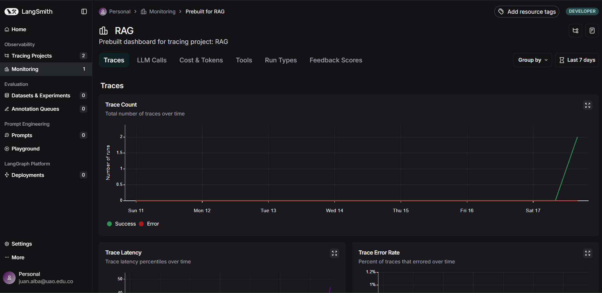

# Chatbot RAG interactivo con PDF

## Descripción

Este proyecto implementa un chatbot interactivo que responde preguntas basadas en documentos PDF utilizando la técnica **Retrieval-Augmented Generation (RAG)**. Combina extracción de texto, creación de embeddings, búsqueda vectorial y generación de texto contextualizada, usando herramientas como Langchain, ChromaDB, Ollama y Streamlit.

Forma parte de la especialización en Inteligencia Artificial, integrando conceptos clave vistos en clase para un desarrollo ágil y modular.

---

## Estructura del proyecto

chatbot-rag/
├── src/
│ ├── app.py # Código principal del chatbot
│ └── rag.py # Lógica de procesamiento RAG
├── data/
│ ├── documento.pdf # PDF de ejemplo para pruebas
│ └── imagen_langchain.jpeg
├── .gitignore # Archivos y carpetas excluidos del repositorio
├── pyproject.toml # Configuración opcional de proyecto
├── .python-version # Versión de Python usada (opcional)
├── README.md # Esta documentación
└── requirements.txt # Dependencias del proyecto


---

## Instalación y configuración

### 1. Clonar el repositorio

```bash
git clone https://github.com/tu_usuario/chatbot-rag.git
cd chatbot-rag

2. Crear y activar entorno virtual

python -m venv .venv
# Linux/macOS
source .venv/bin/activate
# Windows PowerShell
.venv\Scripts\activate

3. Instalar dependencias

pip install -r requirements.txt

4. Instalar paquete extra para Ollama LLM
El paquete langchain-community-llms-ollama no está en PyPI y debe instalarse manualmente:

pip install git+https://github.com/usuario/langchain-community-llms-ollama.git

5. Configurar variables de entorno
Crear archivo .env en la raíz con:

LANGSMITH_API_KEY=tu_api_key_aqui

Uso
Ejecutar la aplicación
bash
Copiar
Editar
streamlit run src/app.py
Funcionalidades
Carga de archivos PDF para crear base de conocimiento.

Preguntas interactivas sobre el contenido del PDF.

Visualización de historial de conversación.

Monitoreo de interacciones en Langsmith (si está configurado).

Ejemplos de consultas de prueba
Pregunta	Respuesta esperada
¿Qué es la inteligencia artificial?	Definición, historia y clasificación de la IA.
¿Cuáles son las técnicas de aprendizaje automático?	Supervisado, no supervisado y por refuerzo.
¿Qué es RAG y cómo se aplica?	Explicación del método Retrieval-Augmented Generation.

Consideraciones técnicas
Modelo de embeddings: nomic-embed-text (Ollama, local).

Base de datos vectorial: ChromaDB con persistencia.

Interfaz: Streamlit (posible adaptación a Mesop).

Monitoreo: Langsmith para trazabilidad y métricas.

IMAGEN


